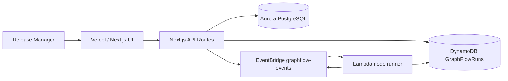

# GraphFlow Architecture

GraphFlow is scoped as a release intelligence app for engineering teams.

Open the editable draw.io diagram:

```text
docs/architecture.drawio
```



## Data Model

Aurora PostgreSQL stores the durable release graph:

- workflows
- workflow_nodes
- workflow_edges

DynamoDB stores runtime state:

- run metadata
- node status records
- event log records

## Scale Shape

GraphFlow separates stable graph definition data from high-volume run state.

- Aurora PostgreSQL is the source of truth for workflow graph definitions.
- The hackathon backend also accepts workflow config registration into DynamoDB so projects can onboard through CI immediately.
- Workflow reads try Aurora PostgreSQL first and fall back to DynamoDB/static demo data for resilience.
- DynamoDB stores write-heavy run state and node/event updates.
- DynamoDB uses on-demand capacity, project-level GSI indexing, and retention-ready records.
- EventBridge carries release events without coupling ingest APIs to workers.
- Lambda workers can process node events independently as volume grows.

This avoids putting every CI event into a relational database while still keeping graph definitions
queryable and deliberate.

## Why Graph-First

Flat task runners can tell you that a job failed. GraphFlow can compute what that failure blocks,
which downstream deploys are affected, and whether the failed node is on the critical path.

## MVP Boundary

This hackathon build focuses on one workflow: production release orchestration. The demo proves the
graph-native model through critical path analysis, blocker detection, and downstream impact.
