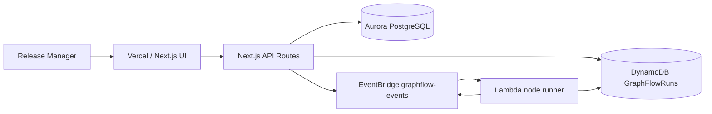

# GraphFlow Architecture

GraphFlow is scoped as a release intelligence app for engineering teams.

## Data Model

Aurora PostgreSQL stores the durable release graph:

- workflows
- workflow_nodes
- workflow_edges

DynamoDB stores runtime state:

- run metadata
- node status records
- event log records

## Why Graph-First

Flat task runners can tell you that a job failed. GraphFlow can compute what that failure blocks,
which downstream deploys are affected, and whether the failed node is on the critical path.

## MVP Boundary

This hackathon build focuses on one workflow: production release orchestration. The demo proves the
graph-native model through critical path analysis, blocker detection, and downstream impact.
